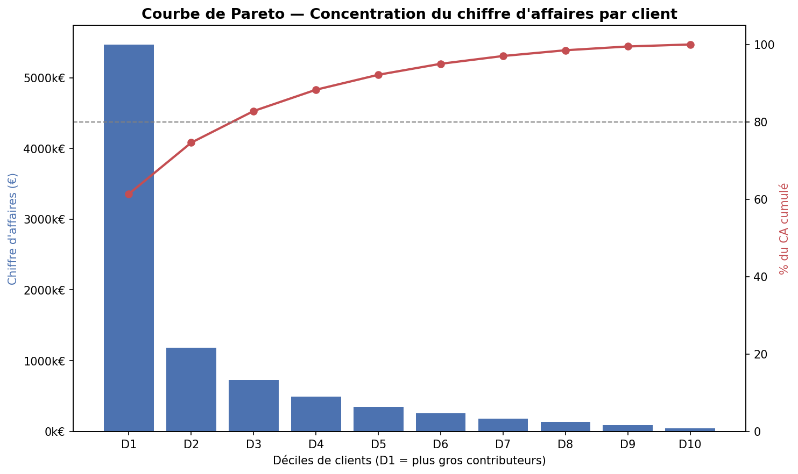
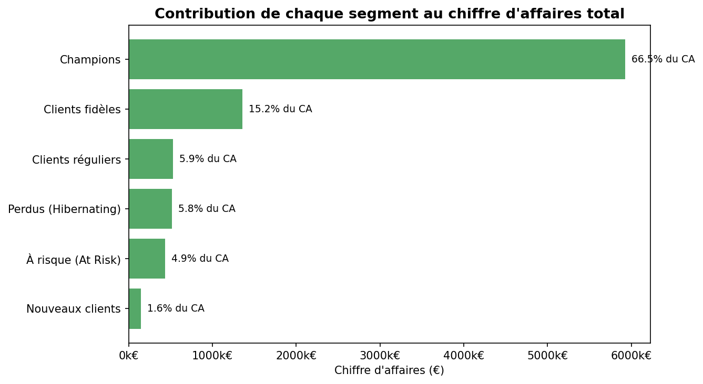
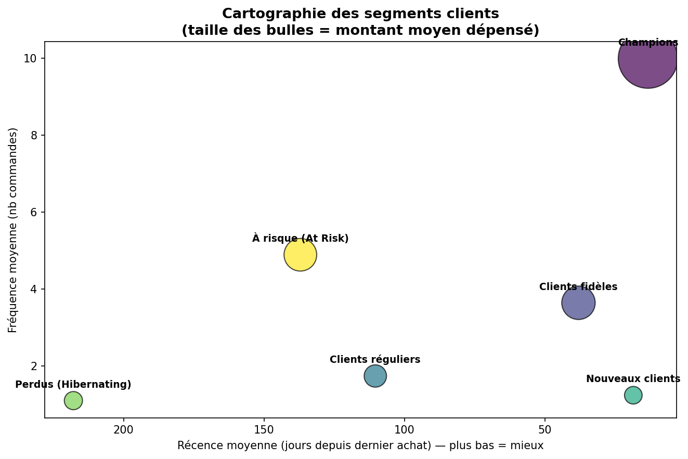

# 🎯 Segmentation client RFM — Online Retail

Analyse de segmentation client (Récence / Fréquence / Montant) sur l'historique de transactions d'un e-commerçant britannique, avec identification des segments à forte valeur et des clients à risque de churn.

---

## 📌 Contexte & Objectif

Un site e-commerce dispose d'un historique de transactions (~542 000 lignes) mais n'a **aucune segmentation client** pour prioriser ses actions marketing et CRM.

**Mission** : identifier les clients à plus forte valeur, quantifier la concentration du chiffre d'affaires (loi de Pareto), et détecter les clients à risque de churn afin d'orienter une stratégie de rétention basée sur les données plutôt que sur l'intuition.

## 🔧 Démarche

1. **Nettoyage & diagnostic qualité** — exclusion des lignes sans identifiant client, des annulations, et des valeurs aberrantes (méthode IQR).
2. **Construction de la segmentation RFM** — calcul de la Récence, Fréquence et Montant par client, scoring en quintiles.
3. **Double segmentation** — règles métier (Champions, À risque, Perdus...) validées par un clustering K-Means non supervisé (méthode du coude pour le choix de *k*).
4. **Analyse de Pareto** — quantification de la concentration du chiffre d'affaires.
5. **Restitution visuelle** — 3 graphiques conçus pour une audience direction (pas de camembert, pas de 3D — lecture immédiate du message).

## 📊 Résultats clés

| Indicateur | Valeur |
|---|---|
| Volume de données brut | 541 909 lignes |
| Dataset exploitable après nettoyage | 397 884 transactions (73,4 % du volume initial) |
| Clients uniques analysés | 4 338 |
| **Concentration du CA (Pareto)** | **26,1 % des clients génèrent 80 % du chiffre d'affaires** |
| **Segment "Champions"** | 1 139 clients (26,3 %) → **66,5 % du CA total** (≈ 5,93 M€) |
| **Segment "À risque"** | 275 clients → 433 237 € de CA historique à réactiver en priorité |

### Courbe de Pareto — concentration du chiffre d'affaires


### Contribution de chaque segment au chiffre d'affaires


### Cartographie des segments (Récence x Fréquence, taille = Montant moyen)


## 💡 Synthèse exécutive

> 26,1 % des clients (les *Champions*) portent 80 % du chiffre d'affaires. Un segment de clients à forte valeur historique mais inactifs (*À risque*) représente 433 K€ de CA récurrent potentiellement perdu — une campagne de réactivation ciblée est recommandée en priorité sur ce segment plutôt que sur l'acquisition de nouveaux clients.

## 🗂️ Structure du repo

```
rfm-customer-segmentation/
├── README.md
├── requirements.txt
├── data/
│   ├── raw/              # Données brutes (non versionnées, voir Source des données)
│   └── processed/        # Données nettoyées (générées par le notebook)
├── notebooks/
│   └── Analyse_RFM_Online_Retail.ipynb
├── src/                   # Pipeline modularisé (réutilisable hors notebook)
│   ├── data_cleaning.py    # Chargement, diagnostic qualité, nettoyage
│   ├── rfm.py               # Calcul RFM, scoring, segmentation métier
│   ├── clustering.py        # Segmentation alternative K-Means
│   ├── pareto.py             # Analyse de concentration du CA
│   ├── visualization.py      # Les 4 graphiques de restitution
│   ├── reporting.py           # Génération de la synthèse exécutive
│   └── main.py                 # Orchestration du pipeline complet
└── reports/
    └── figures/           # Visuels exportés pour la restitution
```

## 🚀 Démo interactive (Streamlit)

Une démo interactive est disponible dans `streamlit_app/app.py` : filtre par segment, choix du nombre de clusters K-Means en direct, et possibilité d'importer un autre fichier au même format pour recalculer la segmentation à la volée.

```bash
pip install -r requirements.txt
streamlit run streamlit_app/app.py
```

La démo embarque un jeu de données pré-calculé (`data/processed/rfm_demo.csv`, ~220 Ko) pour fonctionner immédiatement sans nécessiter le fichier brut (23 Mo, non versionné). Déployable gratuitement sur [Streamlit Community Cloud](https://streamlit.io/cloud) en pointant vers `streamlit_app/app.py`.

## 📥 Source des données

Dataset **Online Retail** (transactions UK, 2010-2011), disponible publiquement sur le [UCI Machine Learning Repository](https://archive.ics.uci.edu/dataset/352/online+retail). Le fichier brut n'est pas versionné dans ce repo (poids et licence de redistribution) — à télécharger et placer dans `data/raw/`.

## ▶️ Reproduire l'analyse

```bash
# 1. Cloner le repo et installer les dépendances
git clone https://github.com/<ton-username>/rfm-customer-segmentation.git
cd rfm-customer-segmentation
pip install -r requirements.txt

# 2. Placer le fichier de données dans data/raw/
#    (Online Retail.xlsx, téléchargé depuis la source ci-dessus)

# 3a. Lancer l'analyse via le notebook (exploration pas à pas)
jupyter notebook notebooks/Analyse_RFM_Online_Retail.ipynb

# 3b. OU lancer le pipeline complet en une commande (depuis la racine du repo)
python -m src.main
```

Le script `src/main.py` exécute l'intégralité du pipeline (nettoyage → RFM → segmentation → Pareto → visuels → synthèse) et régénère les 4 graphiques dans `reports/figures/`. Les fonctions de `src/` sont indépendantes et réutilisables sur un autre jeu de données au même format.

## 🛠️ Stack technique

`Python` · `Pandas` · `NumPy` · `Scikit-learn` (K-Means) · `Matplotlib` / `Seaborn`

## 🔭 Pistes d'amélioration

- Ajouter un scoring de probabilité de churn (modèle supervisé) en complément de la segmentation.
- Déployer un dashboard interactif (Streamlit) pour explorer les segments dynamiquement.
- Ajouter des tests unitaires sur les fonctions de `src/` (pytest) pour sécuriser les évolutions futures.

---

*Projet réalisé dans le cadre de la construction d'un portfolio Data Science — [ton nom] · [lien LinkedIn] · [lien portfolio]*
